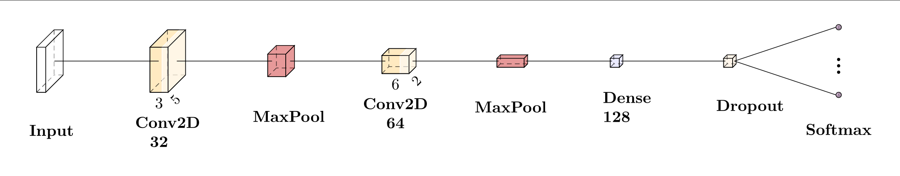

# [Personal Website](davidemodolo.dev)

The idea is to have an interactive version of my CV.

# Content of the web page
Passionate about exploring all aspects of <strong>Artificial Intelligence</strong> - from computer vision to natural language processing with deep learning and classical machine learning. 
Eager to apply my knowledge in real-world scenarios and continue growing in this exciting field.

## Education
<table>
    <tr>
        <td>Master's Degree in Artificial Intelligence Systems</td>
        <td align="right">@ <strong>University of Trento</strong> | Trento, Italy</td>
    </tr>
    <tr>
        <td>Bachelor's Degree in Computer Science</td>
        <td align="right">@ <strong>University of Trento</strong> | Trento, Italy</td>
    </tr>
</table>

## Work Experience
<table>
    <tr>
        <td>AI Engineer Intern</td>
        <td align="right">@ <strong>Eurecat Technology Center</strong> | Barcelona, Spain</td>
    </tr>
    <tr>
        <td>Android App Developer Intern</td>
        <td align="right">@ <strong>University of Trento</strong> | Trento, Italy</td>
    </tr>
</table>

## University Projects

<table>
    <tr>
        <th align="left">Project</th>
        <th align="left">Course</th>
        <th align="center">Slides</th>
        <th align="center">Report</th>
        <th align="center">Code</th>
    </tr>
    <tr>
        <td>COVID-19 Lung Ultrasound Images Classification</td>
        <td>Medical Imaging Diagnostics</td>
        <td align="center"><a href="https://github.com/davidemodolo/Lung-Ultrasound-Image-Classifier/blob/master/ProjectPresentation.pdf">📊</a></td>
        <td align="center"><a href="https://github.com/davidemodolo/Lung-Ultrasound-Image-Classifier/blob/master/Medical_Imaging_Diagnostic_Report.pdf">📄</a></td>
        <td align="center"><a href="https://github.com/davidemodolo/Lung-Ultrasound-Image-Classifier">💻</a></td>
    </tr>
    <tr>
        <td>Joint Intent Detection and Slot Filling</td>
        <td>Natural Language Understanding</td>
        <td align="center"></td>
        <td align="center"><a href="https://github.com/davidemodolo/NLU_Intent_and_Slot/blob/master/NLU_Report_Modolo.pdf">📄</a></td>
        <td align="center"><a href="https://github.com/davidemodolo/NLU_Intent_and_Slot">💻</a></td>
    </tr>
    <tr>
        <td>Domain Adaptation / Transfer Learning <em>- team project</em></td>
        <td>Deep Learning</td>
        <td align="center"></td>
        <td align="center"></td>
        <td align="center"><a href="https://github.com/davidemodolo/HoMM-DomainAdaptation">💻</a></td>
    </tr>
    <tr>
        <td>Autonomous Delivery BDI Agent <em>- team project</em></td>
        <td>Autonomous Software Agents</td>
        <td align="center"><a href="https://github.com/davidemodolo/ASA_Delivery_Bot/blob/main/ASA_Slides.pdf">📊</a></td>
        <td align="center"><a href="https://github.com/davidemodolo/ASA_Delivery_Bot/blob/main/ModoloMoletta.pdf">📄</a></td>
        <td align="center"><a href="https://github.com/davidemodolo/ASA_Delivery_Bot">💻</a></td>
    </tr>
    <tr>
        <td>Parallel Closest Pair of Points <em>- team project</em></td>
        <td>High Performance Computing</td>
        <td align="center"><a href="https://github.com/davidemodolo/Closest-pair-of-points-HPC/blob/master/HPC-Slides.pdf">📊</a></td>
        <td align="center"><a href="https://github.com/davidemodolo/Closest-pair-of-points-HPC/blob/master/Closest_Pair_of_Points_Report.pdf">📄</a></td>
        <td align="center"><a href="https://github.com/davidemodolo/Closest-pair-of-points-HPC">💻</a></td>
    </tr>
</table>

## Interactive Demos

### Digit Classifier
A Convolutional Neural Network (CNN) digit recognition demo trained on the MNIST dataset using **TensorFlow.js**.
<p align="center">
    
</p>

### Sentiment Analysis
An AI model that analyzes text sentiment on a scale from 0 (negative) to 1 (positive), using the **ml5.js** library.

<p align="center">
    
</p>

## General Skills

- Artificial Intelligence
- Machine Learning & Deep Learning
- Natural Language Processing (NLP)
- Computer Vision
- Automated Planning
- Software Engineering
- Mobile Development (Android)
- Parallel & High-Performance Computing
- Teamwork & Collaboration
- Research & Technical Writing

## Structure
```
.
├── digit-classifier-tf-js      // html used for training on the mnist dataset
├── favicon.ico
├── image.png
├── index.html
├── js                          // all the scripts for the interactive webpage
│   ├── easter-egg.js           // spoiler?
│   ├── mnist-classifier.js
│   ├── sentiment-analyzer.js
│   └── window-manager.js
├── mnist-model.json            // trained model structure
├── mnist-model.weights.bin     // trained model weights
├── MyResume.pdf                // full resume to download
├── README.md
└── styles.css
```